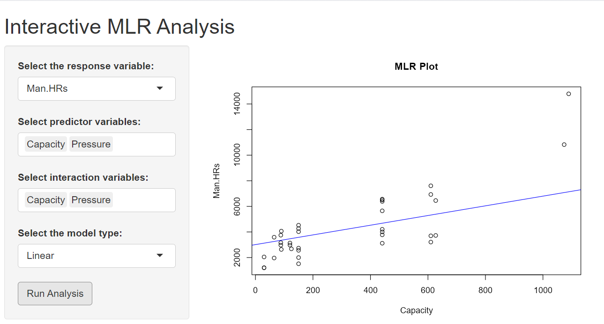
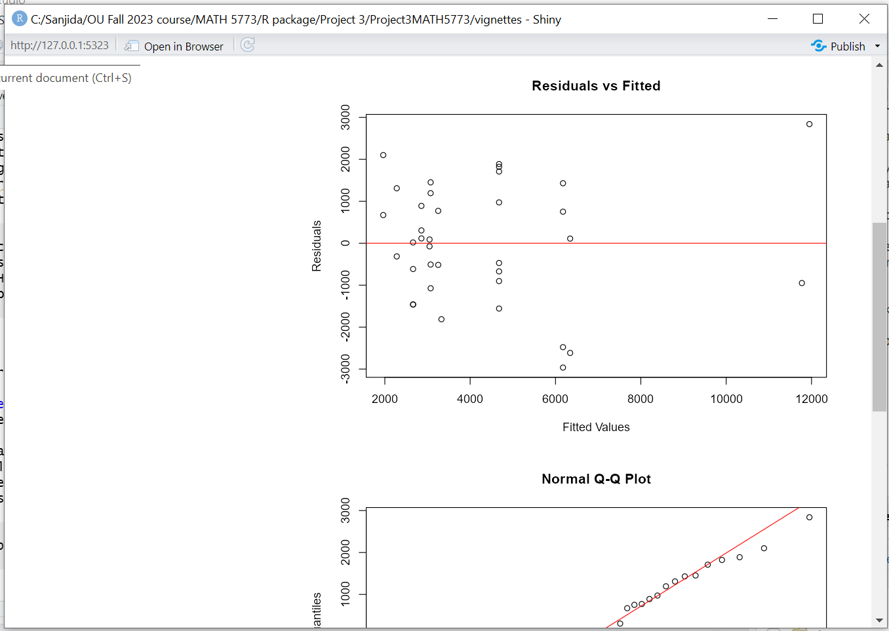
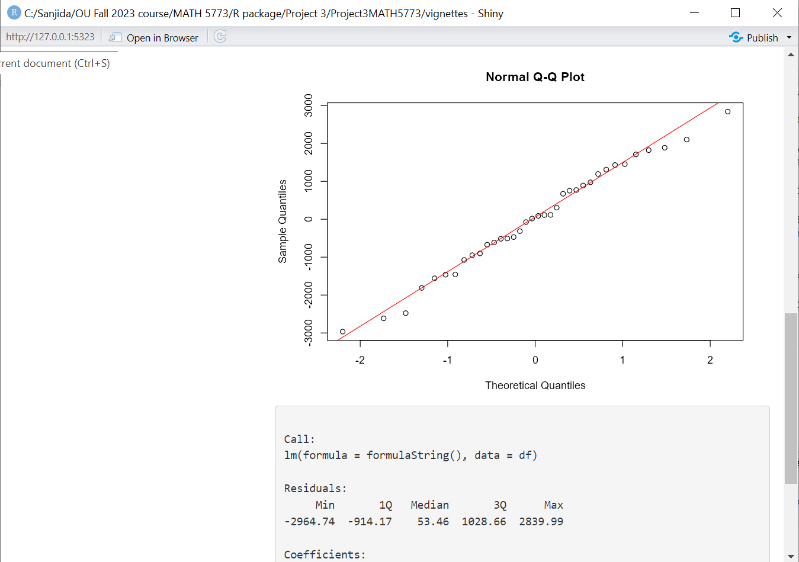
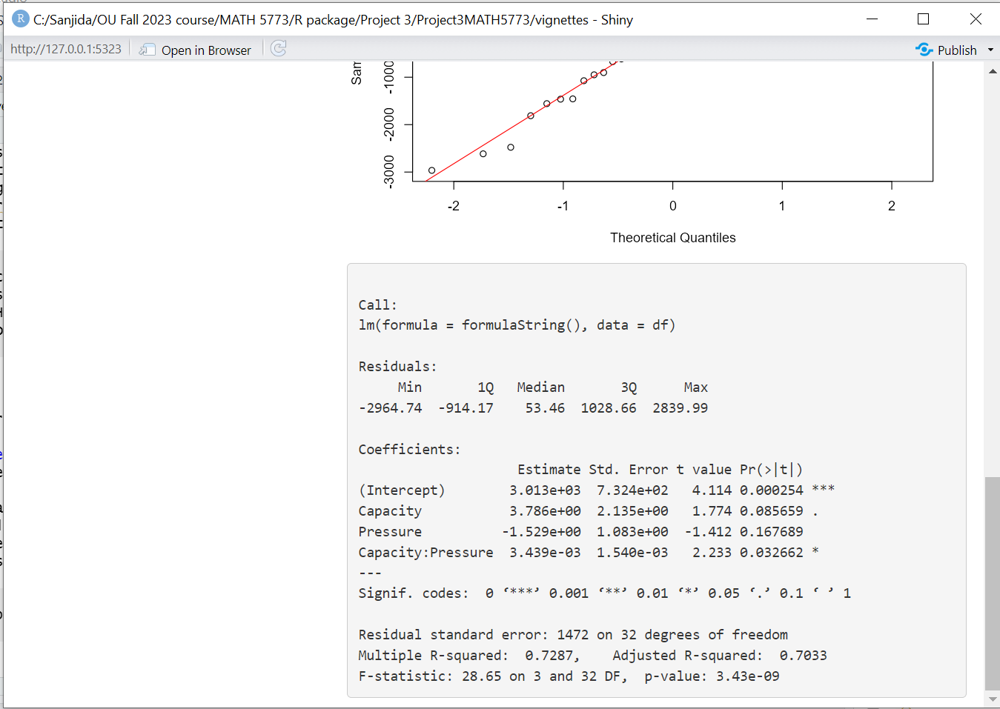

```{r, include = FALSE}
knitr::opts_chunk$set(
  collapse = TRUE,
  comment = "#>"
)
```

```{r setup}
library(Project3MATH5773)
```

## Introduction:
### Classical Linear Regression: 

The classical linear regression model is based on the following equation:
\[{Y = \beta_0 + \beta_1X_1 + \beta_2X_2 + \ldots + \beta_pX_p + \epsilon}\]
Where:
$Y$ is the dependent variable;
$\beta_0$ is the intercept;
$\beta_1, \beta_2, \ldots, \beta_p$ are the coefficients of the independent variables $X_1, X_2, \ldots, X_p$;
$\epsilon$ is the error term, representing random variability.

The goal of classical linear regression is to estimate the values of the coefficients $\beta_0, \beta_1, \ldots, \beta_p$ that best fit the observed data by minimizing the sum of squared residuals, known as the least squares method. Classical regression provides point estimates and confidence intervals for the coefficients.

### Bayesian Linear Regression:
Bayesian linear regression takes a probabilistic approach to modeling. In Bayesian regression, we treat the regression coefficients $\beta_0, \beta_1, \ldots, \beta_p$ as random variables with prior distributions.
The primary equation in Bayesian regression is expressed as:
\[p(\theta|x)\propto p(\theta)f(x|\theta)\]

In Bayesian regression,  the posterior distribution of the coefficients given the data, using Bayes' theorem:
\[p(\beta_0, \beta_1, \ldots, \beta_p | Y, X_1, X_2, \ldots, X_p) \propto p(Y | \beta_0, \beta_1, \ldots, \beta_p, X_1, X_2, \ldots, X_p) \cdot p(\beta_0, \beta_1, \ldots, \beta_p)\]
Where:
$p(\beta_0, \beta_1, \ldots, \beta_p)$ is the prior distribution of the coefficients.
$p(Y | \beta_0, \beta_1, \ldots, \beta_p, X_1, X_2, \ldots, X_p)$ is the likelihood of the data given the coefficients.
### Point estimate
Generally, Bayesians use the posterior mean as the point estimate. The reason for this is that the posterior mean minimizes the mean posterior squared error.

\[\hat{\theta} = E(\theta|x)=\mu_{\theta|x}\]

### Interval estimates
These come in many flavours but the common ones are quantile intervals, often called Bayesian Credible Intervals, BCI.

\[BCI=[\theta_{\alpha/2}, \theta_{1-\alpha/2}]\]
Or HDI, Highest Density Interval

\[HDI = [\theta_L, \theta_U]\]
The HDI is made so that the area above the interval is $1-\alpha$ but the distance $\theta_U-\theta_L$ is smallest.
In both cases $P(\theta\in Interval) = 1-\alpha$ 
where $\alpha$ is the sum of the upper tail areas of the posterior $\theta$ distribution.

## Functions
### Function 1
The "analyze_mlr_model" function is designed for conducting multiple linear regression (MLR) analysis to compare a reduced model (without interactions) and a full model (with two-way interactions). This function will help to analyze the effects of predictors on a response variable and the influence of interactions between predictors. To perform the analysis, the function requires a data frame, dependent (response) variable, independent (predictor) variables.
The function first validates the input data and variables. It then constructs and fits two models which is a reduced model using only the main effects and a full model incorporating two-way interactions. Use AIC to find a better fitted model. Investigate Cook's distance to identify influential observations that might affect the model. Diagnostic plots (Residuals vs Fitted, Normal Q-Q, Histogram of Residuals) are generated for both models to assess model assumptions and fit.

```{r,fig.height=6, fig.width=8}
analyze_mlr_model(boiler, "Man.HRs", c("Capacity", "Pressure"))
```

The hypothesis are-
\[H_0: \beta_3 = 0\]
\[H_a: \beta_3 \neq 0\]
From the result, we can reject the null hypothesis. Also, capacity is significant in both models and the interaction term in the full model is significant, which suggests that the relationship between Capacity and Man.HRs may be influenced by the level of Pressure. The full model has a better fit based on the AIC and the increased R-squared value. The full model also shows a influential point based on the cook's distance. The diagnostic plot validate the assumption. 

### Function 2
The "myboot" function is used to conduct bootstrap estimation for linear regression. Bootstrap estimation is a re-sampling technique used to estimate the distribution of an estimator by re-sampling with replacement from the data.
To perform the analysis, the function requires a data frame, dependent (response) variable, independent (predictor) variables, the number of bootstrap iterations and significance level for confidence intervals. The function first validates the input parameters accuracy. It then performs bootstrap re-sampling iter times, each time estimating the regression coefficients using the re-sampled data. The function calculates point estimates and confidence intervals for each coefficient.

```{r,fig.height=6, fig.width=8}
bub
out <- myboot(df = bub, dep_var = "Diameter", ind_vars = c("MassFlux", "HeatFlux"), iter = 2000, alpha = 0.05)
str(out)
```

Histogram of Coefficient 1, the distribution appears to be centered around a value slightly above 1, which aligns with the point estimate provided for the intercept. Histogram of Coefficient 2, the distribution is centered around zero, indicating that the bootstrapped estimates for the first coefficient close to zero. There is a very small effect of this coefficient on the dependent variable. Histogram of Coefficient 3, the distribution for the second coefficient is centered around a negative value, which align with the negative point estimate, indicating a negative relationship with the dependent variable.

The point estimate for the intercept is approximately 1.097919, indicating the expected value of the dependent variable when all independent variables are zero. The point estimate for the first coefficient is -0.000238, which is very close to zero and have a negligent effect on the dependent variable. The point estimate for the second coefficient is -0.072858, indicating a negative effect on the dependent variable. The confidence interval for the intercept shows that the true value of the intercept lies within this range. The significant negative effect of the second coefficient and the negligible effect of the first coefficient are critical.

### Function 3
The function is designed to conduct both Bayesian and classical linear regression analyses on a data set. This function will provide holistic view for statistical modeling and data analysis by providing outputs from both Bayesian and classical perspectives. 

The function allows for the simultaneous execution of Bayesian and classical linear regression. To perform the analysis, the function required a data set, a formula object specifying the regression model, prior list (Optional. If not specified, default priors are used), the confidence level for interval estimates in classical regression.
The function returns a list containing point and interval estimates from classical regression, a summary of the Bayesian regression analysis, Comparative statistics between classical and Bayesian estimates, Geweke and Heidelberger-Welch diagnostics checks and diagnostic plots are generated for the Bayesian analysis, including density plots of the MCMC samples and trace plots to assess convergence.

```{r,fig.height=6, fig.width=8}
a = boiler$Capacity
b = boiler$Pressure
c = boiler$Man.HRs
results <- performAnalyses(boiler, c ~ a + b + a * b)
```

The classical analysis indicates that 'a' has a positive effect and 'b' has a negative effect on the dependent variable, although the effect of 'a' is not statistically significant at the 95% confidence level since the interval includes zero. The interaction term is statistically significant and indicates that the relationship between 'a' and the dependent variable depends on the level of 'b'. The Bayesian mean estimates are very close to the classical point estimates, suggesting consistency in the model’s findings. The Bayesian 95% CI for the coefficients provides a range of values that are plausible for the population parameters, based on the posterior distribution. For all coefficients, the Bayesian intervals are consistent with the classical intervals.

### Function 4
This function creates an interactive Shiny application for performing multiple linear regression (MLR) analysis.
##### User Interaction interface:
Users have to select a response variable and multiple predictor variables from the data set for regression analysis.In the app, user have to choose between linear and quadratic models and interaction terms between predictors (if applicable). For first time, after clicking "Run Analysis," the app will generates a regression model based on user inputs and displays the results. If user want to update the model by choosing different variable, the app will automatically update the results. The main panel of the app displays- Regression Plot, Residuals vs Fitted Plot, Normal Q-Q Plot and Model Summary provide statistical measures.
```{r}
runMLRShinyApp(boiler)
```

{width=100% height=400}
{width=100% height=400}
{width=100% height=400}
{width=100% height=400}

The hypothesis are-
\[H_0: \beta_3 = 0\]
\[H_a: \beta_3 \neq 0\]
From the result, we can reject the null hypothesis. The interaction term Capacity:Pressure has a small positive coefficient and is statistically significant (p = 0.032662), indicating that the effect of Capacity on the outcome variable changes with different levels of Pressure.
